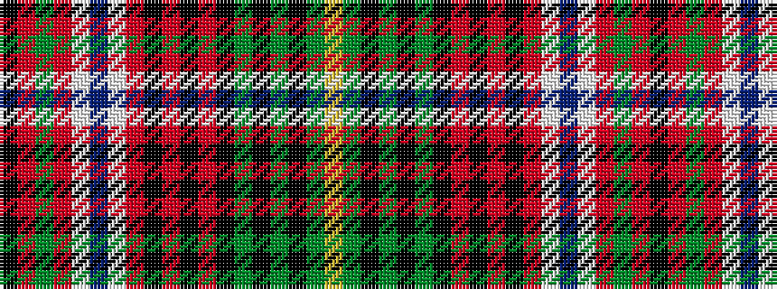

KRGRWBWRKRKRKGKGKGY

It is a 19 stripe tartan.

<figure class="pat-woven">

<figcaption>idealised sample</figcaption>
</figure>

## Colour Sequence



## Tartans with this colour sequence

| Tartans |
|---------------|
| [Princess Beatrice, dress](/setts/k3r1g2r2w20db3w3r7k2r2k2r2k7g2k2g2k2g8ly3/)|
||
