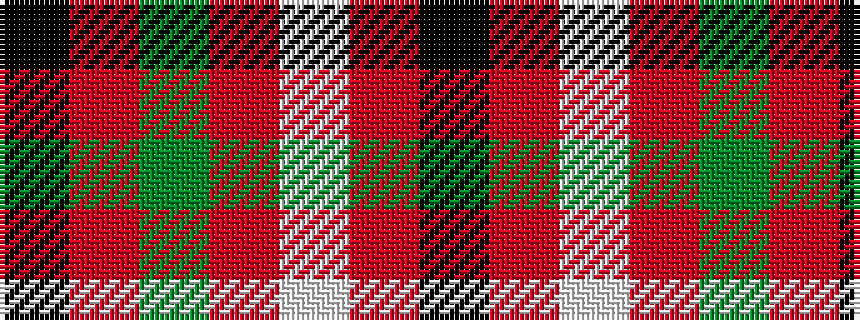

KRGRWRK

It is a 7 stripe tartan.

<figure class="pat-woven">

<figcaption>idealised sample</figcaption>
</figure>

## Colour Sequence



## Tartans with this colour sequence

| Tartans |
|---------------|
| [Cameron Hose](/setts/s7/k1r8dg1r1w8r1k1~x6/)|
||
| [Cameron, Hose](/setts/s7/k1r8g1r1w8r1k1~x6/)|
||
