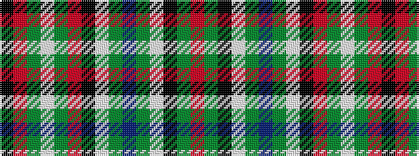

KRGWGRKWGBGWKGR

It is a 15 stripe tartan.

<figure class="pat-woven">

<figcaption>idealised sample</figcaption>
</figure>

## Colour Sequence



## Tartans with this colour sequence

| Tartans |
|---------------|
| [Gayre Bodyguard (Clan)](/setts/s15/r18g4k4w4g16db4g16w4k4r5g4w4g3r5k4~x2/)|
||
