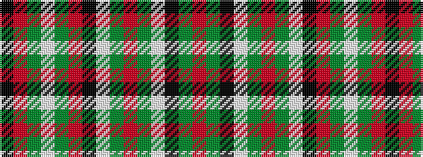

KRGWGRKWGRGWKGR

It is a 15 stripe tartan.

<figure class="pat-woven">

<figcaption>idealised sample</figcaption>
</figure>

## Colour Sequence



## Tartans with this colour sequence

| Tartans |
|---------------|
| [Gayre (Clan)](/variants/s15/r20g4k4lb4g16r4g16lb4k4r6g4lb4g3r6k4~x2/)|
||
