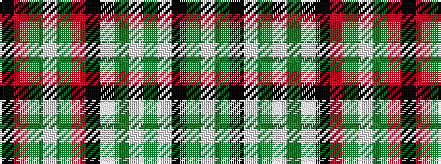

KRGWGRKWGWGWKGW

It is a 15 stripe tartan.

<figure class="pat-woven">

<figcaption>idealised sample</figcaption>
</figure>

## Colour Sequence



## Tartans with this colour sequence

| Tartans |
|---------------|
| [Gayre](/setts/s15/lb20g4k4lbi4g16lb4g16lbi4k4r6g4lbi4g3r6k4~x2/)|
||
