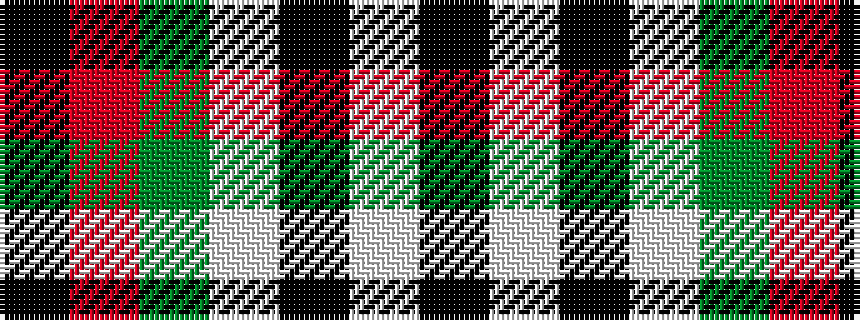

KRGWKWK

It is a 7 stripe tartan.

<figure class="pat-woven">

<figcaption>idealised sample</figcaption>
</figure>

## Colour Sequence



## Tartans with this colour sequence

| Tartans |
|---------------|
| [Wild Highlanders (Corporate)](/variants/s7/k36w3k10w3g28r6k18~x2/)|
||
