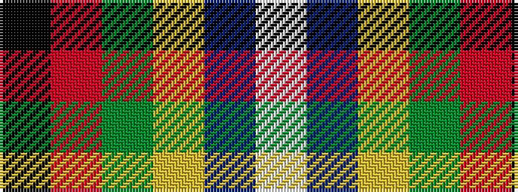

KRGYBW

It is a 6 stripe tartan.

<figure class="pat-woven">

<figcaption>idealised sample</figcaption>
</figure>

## Colour Sequence



## Tartans with this colour sequence

| Tartans |
|---------------|
| [Charlotte Fire Department](/variants/s6/k78r10dg7ly3t2w5~x2/)|
||
| [Charlotte Fire Department](/variants/s6/k75r10g7ly3db2w5~x2/)|
||
| [Kilmaine Saints (Corporate)](/variants/s6/k54o11g13lo1b13w1~x2/)|
||
| [Turnbull of Thornton (Personal)](/variants/s6/k6r3g30ly10db30w3~x2/)|
||
