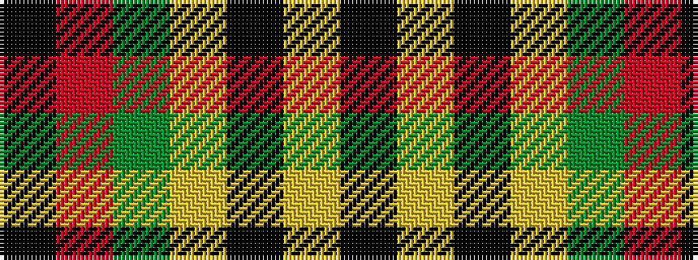

KRGYKYK

It is a 7 stripe tartan.

<figure class="pat-woven">

<figcaption>idealised sample</figcaption>
</figure>

## Colour Sequence



## Tartans with this colour sequence

| Tartans |
|---------------|
| [Logan - 1797 (Dark)](/setts/s7/k9lr4k1lr4dg15r4k1~x4/)|
||
