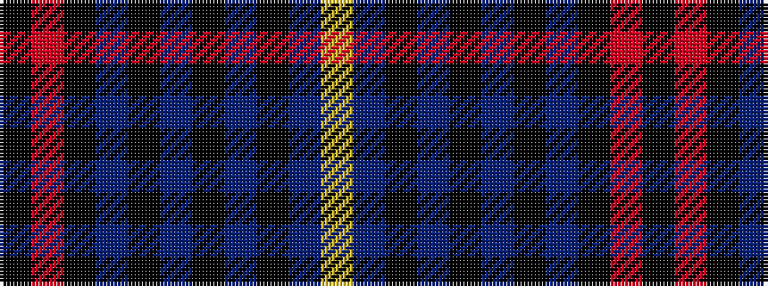

KRKBKBKBKBY

It is a 11 stripe tartan.

<figure class="pat-woven">

<figcaption>idealised sample</figcaption>
</figure>

## Colour Sequence



## Tartans with this colour sequence

| Tartans |
|---------------|
| [Caledonian Dragon (Corporate)](/variants/s11/k3r2k12db8k2db4k2db4k12db22ly3~x2/)|
||
| [Caledonian Oriental Airlines (Corporate)](/variants/s11/k4r3k13dp10k3dp5k3dp5k13dp25lo4~x2/)|
||
