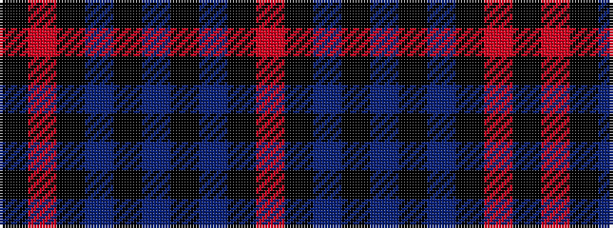

KRKBKBKBKR

It is a 10 stripe tartan.

<figure class="pat-woven">

<figcaption>idealised sample</figcaption>
</figure>

## Colour Sequence



## Tartans with this colour sequence

| Tartans |
|---------------|
| [Selkirk Silver Band (Corporate)](/variants/s10/k75r1k4n15k2n1k3db1k2r1~x2/)|
||
