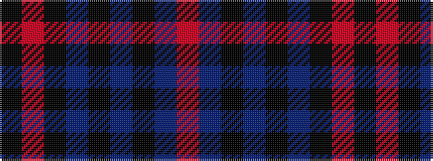

KRKBKBKBR

It is a 9 stripe tartan.

<figure class="pat-woven">

<figcaption>idealised sample</figcaption>
</figure>

## Colour Sequence



## Tartans with this colour sequence

| Tartans |
|---------------|
| [Doune District Tartan Tartan Number: 4707. Earliest known date: 01/01/2002 A colour variation of Stewart Bute. See products available Copyright © Blair Urquhart, Comrie, 2015](/setts/s9/o10t11ki2t3ki2t2ki8o40k4~x2/)|
||
