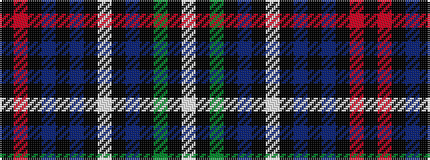

KRKBKBKWKBKGKW

It is a 14 stripe tartan.

<figure class="pat-woven">

<figcaption>idealised sample</figcaption>
</figure>

## Colour Sequence



## Tartans with this colour sequence

| Tartans |
|---------------|
| [Unnamed - C19th (Annie Oakley)](/setts/s14/w4k1dg10k1db7k1w4k1db5k1db2k1r20k2~x4/)|
||
