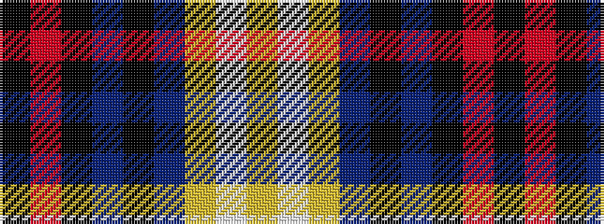

KRKBKBYWY

It is a 9 stripe tartan.

<figure class="pat-woven">

<figcaption>idealised sample</figcaption>
</figure>

## Colour Sequence



## Tartans with this colour sequence

| Tartans |
|---------------|
| [Victory](/variants/s9/k2r3k36n2k5n7ly3lt5lg2~x2/)|
||
