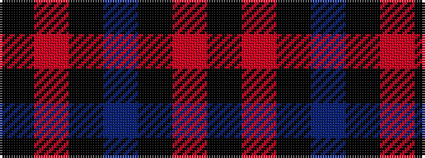

KRKBKRK

It is a 7 stripe tartan.

<figure class="pat-woven">

<figcaption>idealised sample</figcaption>
</figure>

## Colour Sequence



## Tartans with this colour sequence

| Tartans |
|---------------|
| [Chafyn House (School)](/setts/s7/k72r3k11t9k11r3k37/)|
||
