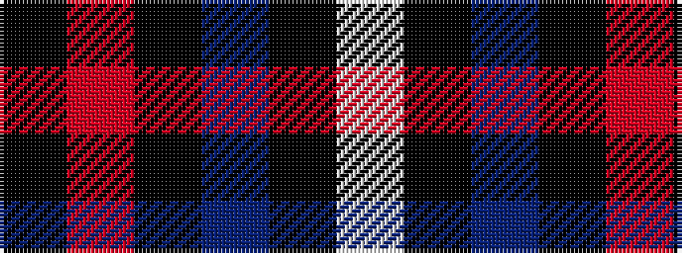

KRKBKW

It is a 6 stripe tartan.

<figure class="pat-woven">

<figcaption>idealised sample</figcaption>
</figure>

## Colour Sequence



## Tartans with this colour sequence

| Tartans |
|---------------|
| [NewGeneration Alchemy (NGA) Inc](/setts/s6/k31r2k10db1k1w1~x4/)|
||
