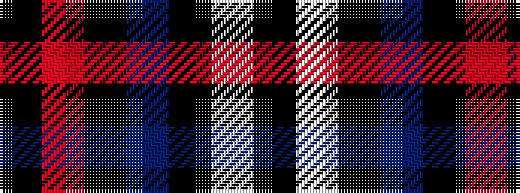

KRKBKWK

It is a 7 stripe tartan.

<figure class="pat-woven">

<figcaption>idealised sample</figcaption>
</figure>

## Colour Sequence



## Tartans with this colour sequence

| Tartans |
|---------------|
| [Sanley-Cantamessa](/setts/s7/k16w15k4db12k22r2k6~x2/)|
||
| [Sanley-Cantamessa (Personal)](/setts/s7/k16w15k4dt12k22r2k6~x2/)|
||
