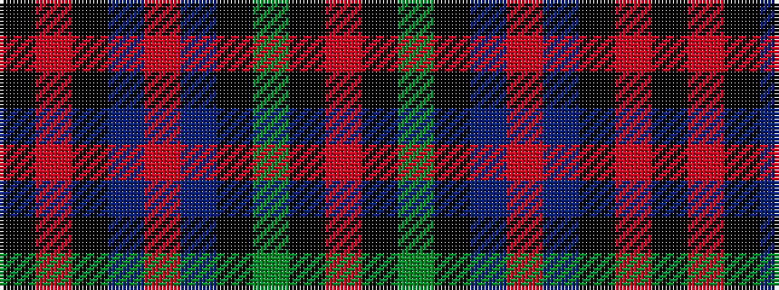

KRKBRBKGKR

It is a 10 stripe tartan.

<figure class="pat-woven">

<figcaption>idealised sample</figcaption>
</figure>

## Colour Sequence



## Tartans with this colour sequence

| Tartans |
|---------------|
| [Cavan](/setts/s10/k3r9k5dr9o3dr9k5g24k2o3~x2/)|
||
