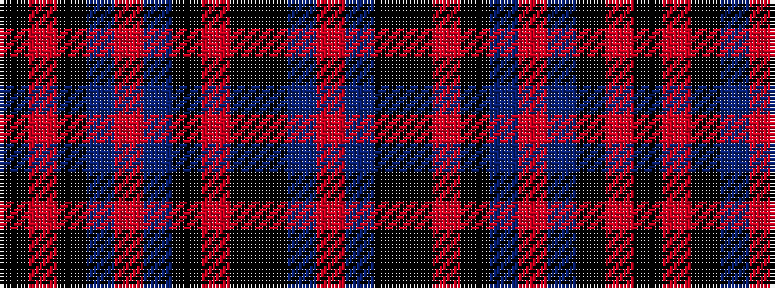

KRKBRBKRKKBR

It is a 12 stripe tartan.

<figure class="pat-woven">

<figcaption>idealised sample</figcaption>
</figure>

## Colour Sequence



## Tartans with this colour sequence

| Tartans |
|---------------|
| [Pride of Scotland Silver](/variants/s12/k9o2k2n2o18n2k2r1k1k19n33r2~x2/)|
||
