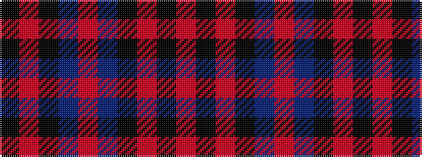

KRKBRBKRKR

It is a 10 stripe tartan.

<figure class="pat-woven">

<figcaption>idealised sample</figcaption>
</figure>

## Colour Sequence



## Tartans with this colour sequence

| Tartans |
|---------------|
| [Harley Davidson](/setts/s10/k49o8k4n6o4n6k4o8k49o2/)|
||
