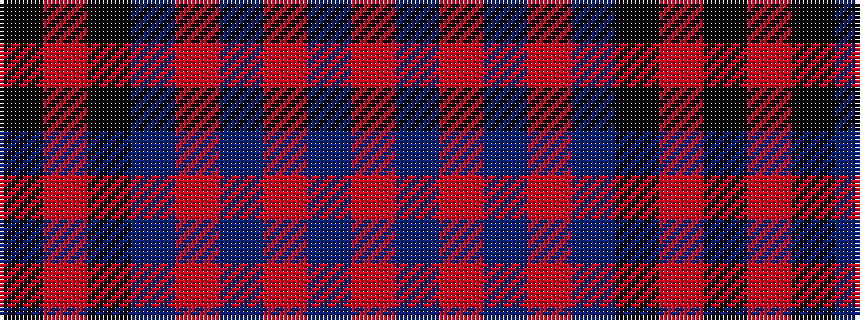

KRKBRBRBR

It is a 9 stripe tartan.

<figure class="pat-woven">

<figcaption>idealised sample</figcaption>
</figure>

## Colour Sequence



## Tartans with this colour sequence

| Tartans |
|---------------|
| [Angus](/setts/s9/k3r1k14db14r1db1r1db1r2~x4/)|
||
| [Angus](/setts/s9/k3r1k32db28r1db2r1db2r3~x2/)|
||
