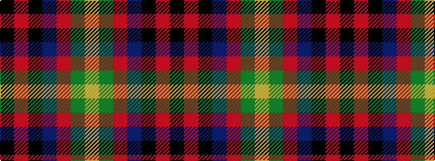

KRKBRGY

It is a 7 stripe tartan.

<figure class="pat-woven">

<figcaption>idealised sample</figcaption>
</figure>

## Colour Sequence



## Tartans with this colour sequence

| Tartans |
|---------------|
| [Royal Marines Condor](/variants/s7/k8r4k36db48r6g3lo2~x2/)|
||
