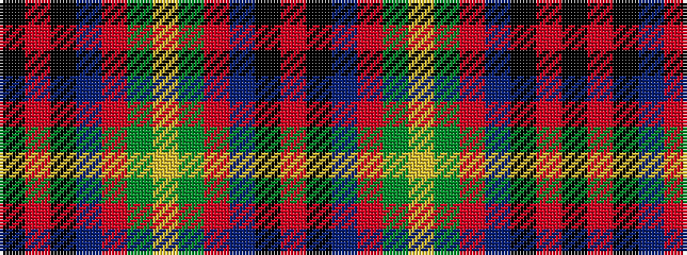

KRKBRGYGRBKR

It is a 12 stripe tartan.

<figure class="pat-woven">

<figcaption>idealised sample</figcaption>
</figure>

## Colour Sequence



## Tartans with this colour sequence

| Tartans |
|---------------|
| [Royal Marines Condor Regimental Tartan Tartan Number: 2330. Earliest known date: 1994 Designed by Jack Dalgety for Lt.Col. Wilsey of Royal Marines, Condor Depot. December 1994. Woven by D.C.Dalgleish of Selkirk. The design is basically the Angus tartan (#1179) which is the Scottish county in which Condor Depot is located with changes to the overcheck. Sample in STA Dalgety Collection. See products available Copyright © Blair Urquhart, Comrie, 2015](/setts/s12/k8r4k36db48r6g3lo2~x2/)|
||
