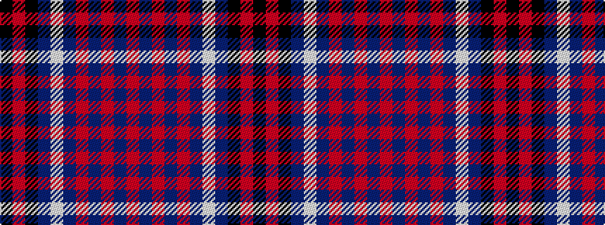

KRKBWBRBRBR

It is a 11 stripe tartan.

<figure class="pat-woven">

<figcaption>idealised sample</figcaption>
</figure>

## Colour Sequence



## Tartans with this colour sequence

| Tartans |
|---------------|
| [Angus Dress 1992 (Dance)](/variants/s11/k3r1k32db6w20db2r1db2r1db2r3~x2/)|
||
