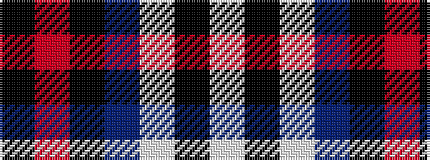

KRKBWKW

It is a 7 stripe tartan.

<figure class="pat-woven">

<figcaption>idealised sample</figcaption>
</figure>

## Colour Sequence



## Tartans with this colour sequence

| Tartans |
|---------------|
| [Edinburgh, The University of](/setts/s7/k8m26k22dt110w4k5w4/)|
||
| [University of Edinburgh](/setts/s7/k8r26k22n110w4k5w4/)|
||
