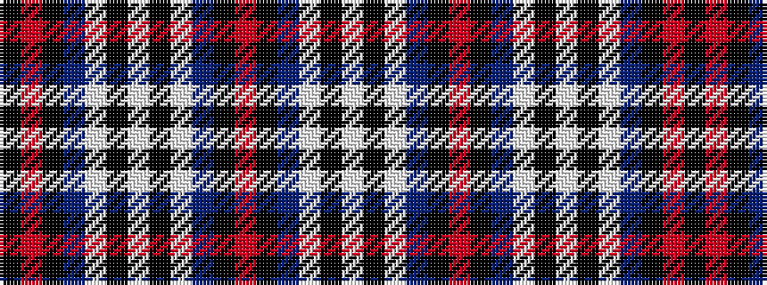

KRKBWKWKWBKRKBWKW

It is a 17 stripe tartan.

<figure class="pat-woven">

<figcaption>idealised sample</figcaption>
</figure>

## Colour Sequence



## Tartans with this colour sequence

| Tartans |
|---------------|
| [Glasgow Caledonian University](/variants/s17/k5r2k30t8w1k9w2k9w1t8k30r3k30t8w1k9w2~x2/)|
||
