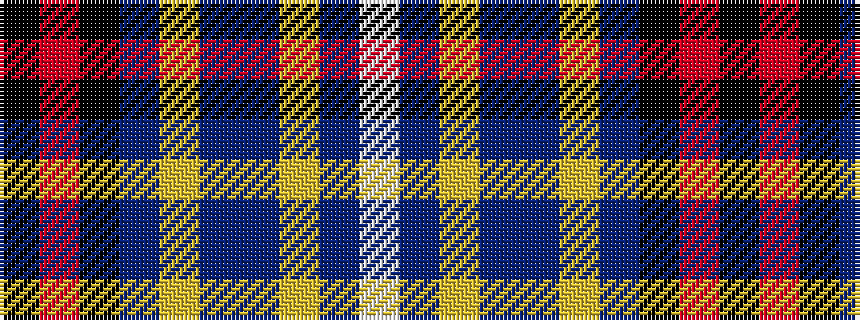

KRKBYBBYBW

It is a 10 stripe tartan.

<figure class="pat-woven">

<figcaption>idealised sample</figcaption>
</figure>

## Colour Sequence



## Tartans with this colour sequence

| Tartans |
|---------------|
| [Highland Gathering (Fashion?)](/variants/s10/k45r4k4do4lo16do76dt8lo6dt2w4/)|
||
