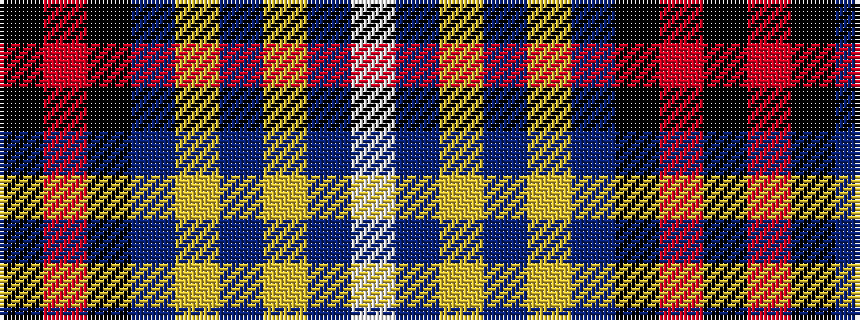

KRKBYBYBW

It is a 9 stripe tartan.

<figure class="pat-woven">

<figcaption>idealised sample</figcaption>
</figure>

## Colour Sequence



## Tartans with this colour sequence

| Tartans |
|---------------|
| [Hill](/setts/s9/k4r2k28b31ly1b2ly1b2w3~x2/)|
||
| [Hill (Name)](/setts/s9/w3db2ly1db2ly1db31k28r2k2~x2/)|
||
