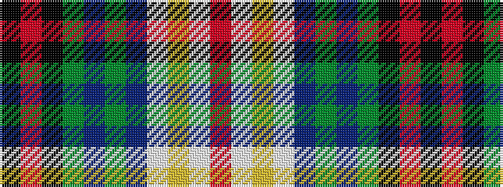

KRKGBGBWYWR

It is a 11 stripe tartan.

<figure class="pat-woven">

<figcaption>idealised sample</figcaption>
</figure>

## Colour Sequence



## Tartans with this colour sequence

| Tartans |
|---------------|
| [Filipino American](/setts/s11/r30w4ly2w4db16dg8dp3dg8k10r3k4~x2/)|
||
