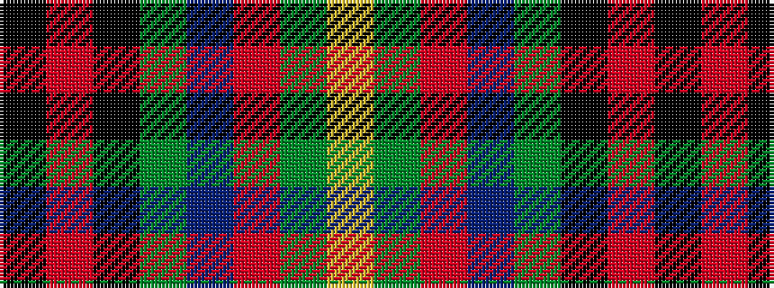

KRKGBRGY

It is a 8 stripe tartan.

<figure class="pat-woven">

<figcaption>idealised sample</figcaption>
</figure>

## Colour Sequence



## Tartans with this colour sequence

| Tartans |
|---------------|
| [Bootneck 350](/setts/s8/k6r4k19dg4db25r5dg3ly2~x2/)|
||
