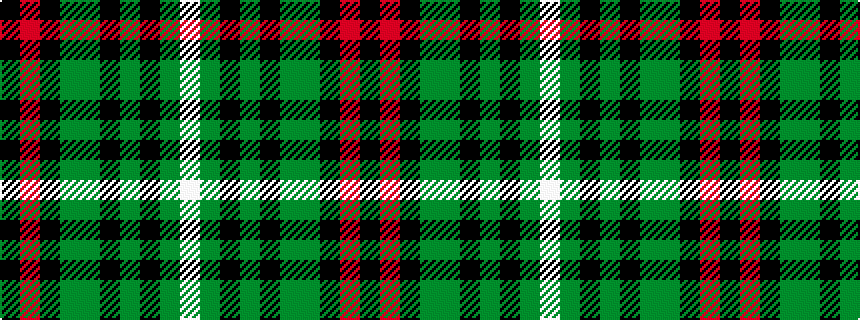

KRKGGKGKGW

It is a 10 stripe tartan.

<figure class="pat-woven">

<figcaption>idealised sample</figcaption>
</figure>

## Colour Sequence



## Tartans with this colour sequence

| Tartans |
|---------------|
| [McCurrach (2014)](/variants/s10/k4r3k16g4dy4k3dy20k3dy4w3~x2/)|
||
