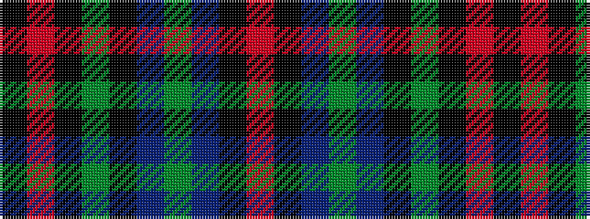

KRKGKBGBKR

It is a 10 stripe tartan.

<figure class="pat-woven">

<figcaption>idealised sample</figcaption>
</figure>

## Colour Sequence



## Tartans with this colour sequence

| Tartans |
|---------------|
| [Process Safety Solutions Ltd](/setts/s10/r4k11n8dg2n8k13dg2k13r5k2~x2/)|
||
