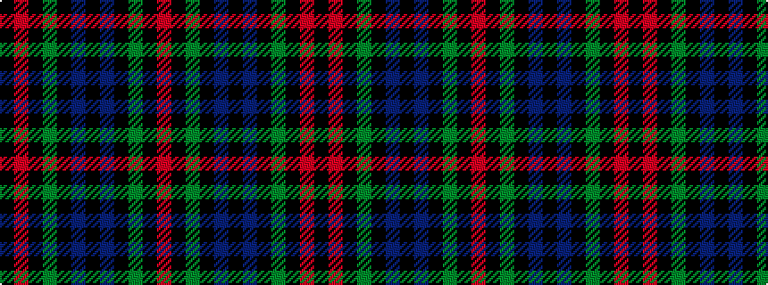

KRKGKBKBKGKR

It is a 12 stripe tartan.

<figure class="pat-woven">

<figcaption>idealised sample</figcaption>
</figure>

## Colour Sequence



## Tartans with this colour sequence

| Tartans |
|---------------|
| [Daly (2016)](/variants/s12/k5r3k24dg13k3db3k3db11k6dg3k3r3~x2/)|
||
