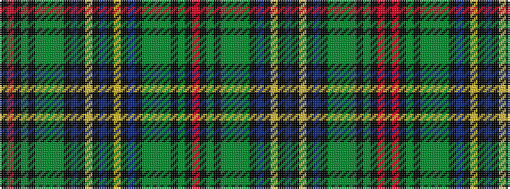

KRKGKGGGGKBKYKBKYKBKGGGGKGKR

It is a 28 stripe tartan.

<figure class="pat-woven">

<figcaption>idealised sample</figcaption>
</figure>

## Colour Sequence



## Tartans with this colour sequence

| Tartans |
|---------------|
| [Wells (Personal)](/variants/s28/db8k4ly3k4db14k4dg4g6dg3g10k10g9k3r3k4~x2/)|
||
