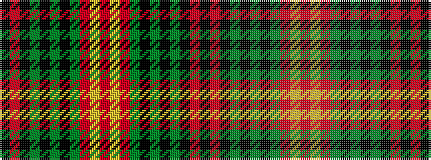

KRKGKGKGRYRYRGKGKGKRK

It is a 21 stripe tartan.

<figure class="pat-woven">

<figcaption>idealised sample</figcaption>
</figure>

## Colour Sequence



## Tartans with this colour sequence

| Tartans |
|---------------|
| [Kinnear, Pilette of](/setts/s21/k2r1k6g2k6g24k4g2r3lr1r2ly1r3g2k4g24k6g2k6r1k2~x2/)|
||
