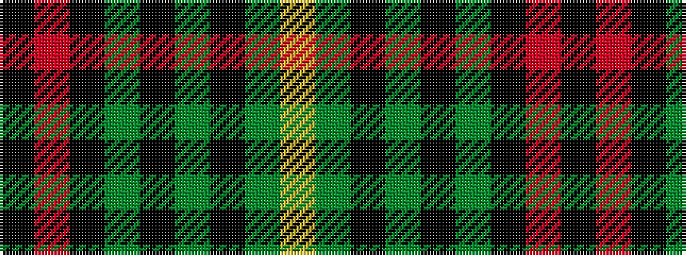

KRKGKGKGY

It is a 9 stripe tartan.

<figure class="pat-woven">

<figcaption>idealised sample</figcaption>
</figure>

## Colour Sequence



## Tartans with this colour sequence

| Tartans |
|---------------|
| [Martin](/setts/s9/ly8g16k6g6k6g6k16r21k5/)|
||
