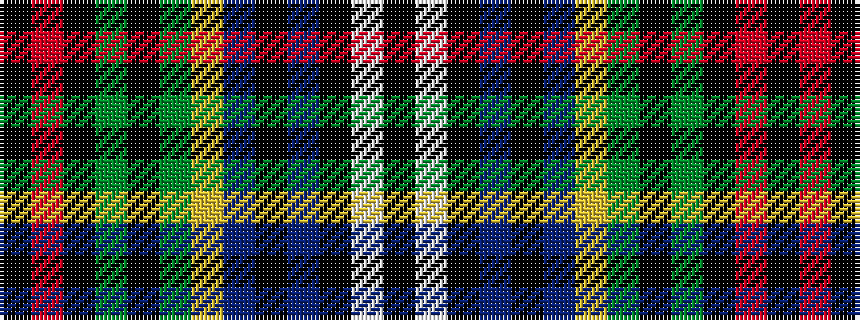

KRKGKGYBKBKWK

It is a 13 stripe tartan.

<figure class="pat-woven">

<figcaption>idealised sample</figcaption>
</figure>

## Colour Sequence



## Tartans with this colour sequence

| Tartans |
|---------------|
| [Survivor](/setts/s13/k1r1k8g1k1g8ly1db8k1db1k8w1k1~x6/)|
||
| [Survivor (Fashion)](/setts/s13/k1r1k8g1k1g8ly1dt8k1dt1k8w1k1~x3/)|
||
