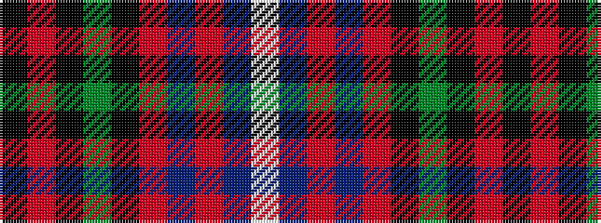

KRKGKRBRBW

It is a 10 stripe tartan.

<figure class="pat-woven">

<figcaption>idealised sample</figcaption>
</figure>

## Colour Sequence



## Tartans with this colour sequence

| Tartans |
|---------------|
| [Manderson #2](/variants/s10/k2o10k5dg8k12r20t16r4t5w2~x2/)|
||
