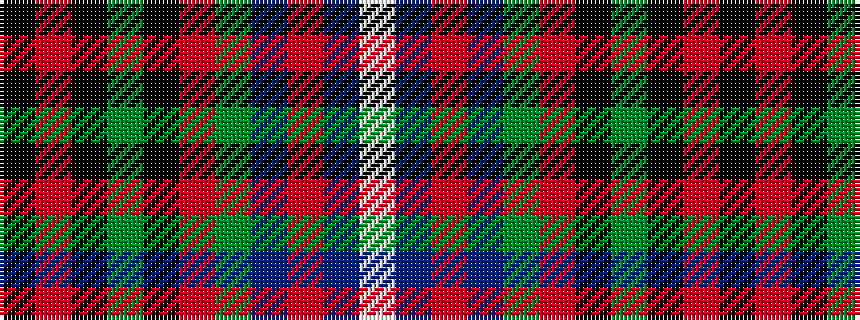

KRKGKRGBRBW

It is a 11 stripe tartan.

<figure class="pat-woven">

<figcaption>idealised sample</figcaption>
</figure>

## Colour Sequence



## Tartans with this colour sequence

| Tartans |
|---------------|
| [Manderson Family Tartan](/variants/s11/k4o10k4g8k12r5g16t16r5t6w2~x2/)|
||
