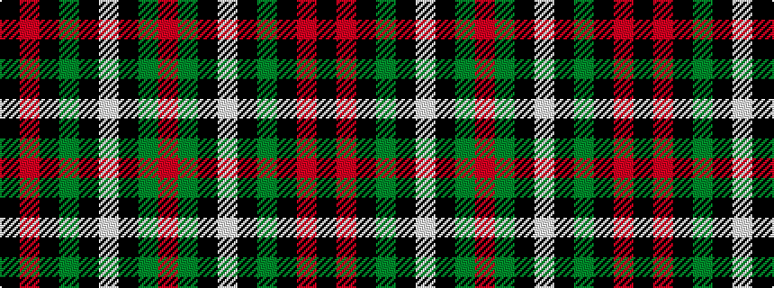

KRKGKWKGR

It is a 9 stripe tartan.

<figure class="pat-woven">

<figcaption>idealised sample</figcaption>
</figure>

## Colour Sequence



## Tartans with this colour sequence

| Tartans |
|---------------|
| [MacDiarmid](/variants/s9/k12r2k28dg12k1w3k1dg12r4~x2/)|
||
| [MacDiarmid (Clan)](/variants/s9/k12r2k28g12k1w3k1g12r4~x2/)|
||
