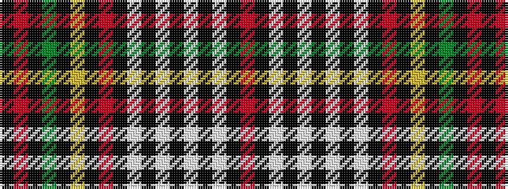

KRKGKYKRKWKWKWKWKR

It is a 18 stripe tartan.

<figure class="pat-woven">

<figcaption>idealised sample</figcaption>
</figure>

## Colour Sequence



## Tartans with this colour sequence

| Tartans |
|---------------|
| [Canadian Dental Association](/setts/s18/r8k3lb15k1w3k1lb8k1w3k1r19k2lo2k2g2k2r2k2~x2/)|
||
