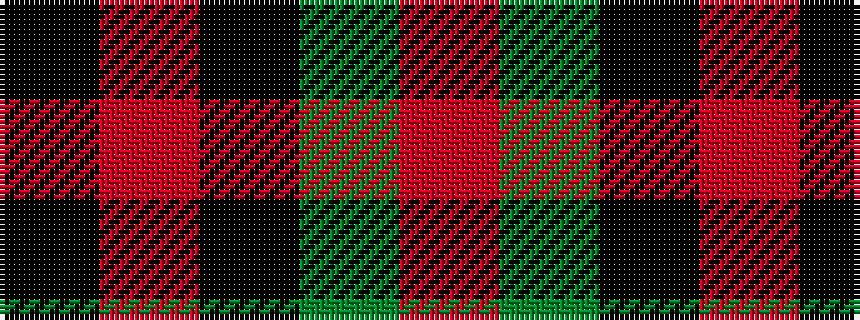

KRKGR

It is a 5 stripe tartan.

<figure class="pat-woven">

<figcaption>idealised sample</figcaption>
</figure>

## Colour Sequence



## Tartans with this colour sequence

| Tartans |
|---------------|
| [Novotel, The](/variants/s5/ki3r11k26dy11ri3~x2/)|
||
