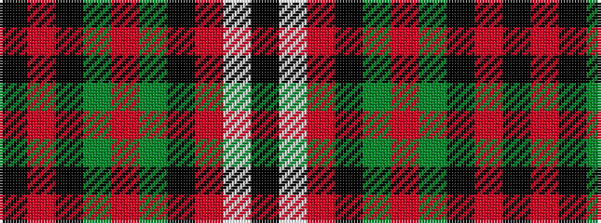

KRKGRGKRWK

It is a 10 stripe tartan.

<figure class="pat-woven">

<figcaption>idealised sample</figcaption>
</figure>

## Colour Sequence



## Tartans with this colour sequence

| Tartans |
|---------------|
| [Valdres, Kvam & Vang #3](/setts/s10/k4w1r4k2g2r3g2k20r2k2~x2/)|
||
