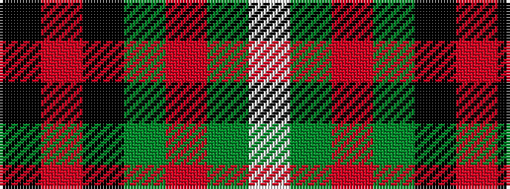

KRKGRGW

It is a 7 stripe tartan.

<figure class="pat-woven">

<figcaption>idealised sample</figcaption>
</figure>

## Colour Sequence



## Tartans with this colour sequence

| Tartans |
|---------------|
| [Ramsay, Red](/setts/s7/k4o9k13g6o3g9w4~x2/)|
||
