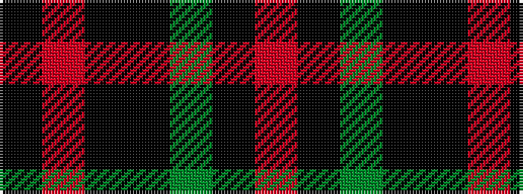

KRKKGKR

It is a 7 stripe tartan.

<figure class="pat-woven">

<figcaption>idealised sample</figcaption>
</figure>

## Colour Sequence



## Tartans with this colour sequence

| Tartans |
|---------------|
| [McEwan "1856", The](/setts/s7/ki3o6ki32k36dg36k4r3/)|
||
