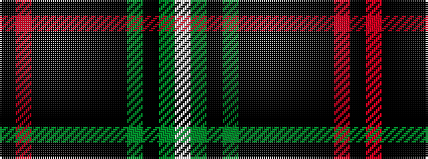

KRKKKKKKGKGW

It is a 12 stripe tartan.

<figure class="pat-woven">

<figcaption>idealised sample</figcaption>
</figure>

## Colour Sequence



## Tartans with this colour sequence

| Tartans |
|---------------|
| [Bannatyne (Corporate)](/setts/s12/k8r8k42k4k4k4k4k20dg4k10dg25w8/)|
||
