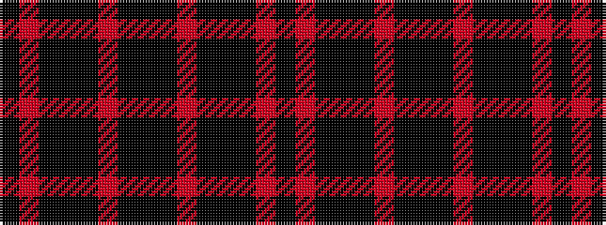

KRKKKRKKKRKKKRK

It is a 15 stripe tartan.

<figure class="pat-woven">

<figcaption>idealised sample</figcaption>
</figure>

## Colour Sequence



## Tartans with this colour sequence

| Tartans |
|---------------|
| [Williams (Welsh Name)](/setts/s15/k26r2k13k2k3r2k6k1k6r2k3k2k30r2k2~x2/)|
||
