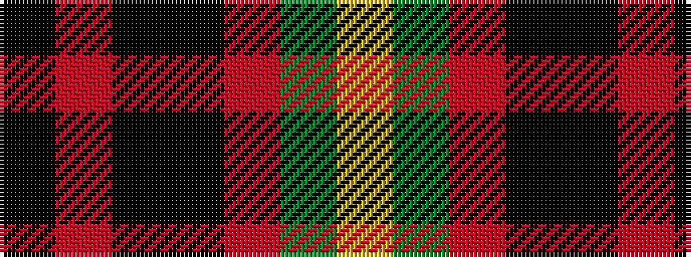

KRKKRGY

It is a 7 stripe tartan.

<figure class="pat-woven">

<figcaption>idealised sample</figcaption>
</figure>

## Colour Sequence



## Tartans with this colour sequence

| Tartans |
|---------------|
| [Royal Marines Condor](/setts/s7/k5r3k27ki37r5g2ly2~x2/)|
||
