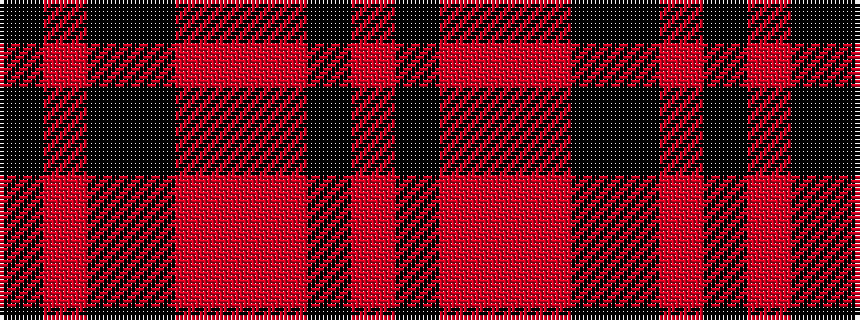

KRKKRRRKR

It is a 9 stripe tartan.

<figure class="pat-woven">

<figcaption>idealised sample</figcaption>
</figure>

## Colour Sequence



## Tartans with this colour sequence

| Tartans |
|---------------|
| [Henry, W. A. (Commemorative)](/setts/s9/k16r16k3k16r2r1r2k6r2~x4/)|
||
