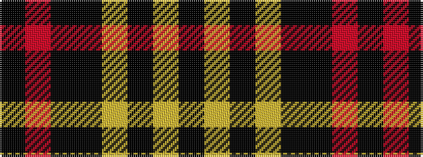

KRKKYKYK

It is a 8 stripe tartan.

<figure class="pat-woven">

<figcaption>idealised sample</figcaption>
</figure>

## Colour Sequence



## Tartans with this colour sequence

| Tartans |
|---------------|
| [Printing Industries of America](/setts/s8/k7r2k2ki6lo1ki1lo1ki4~x4/)|
||
