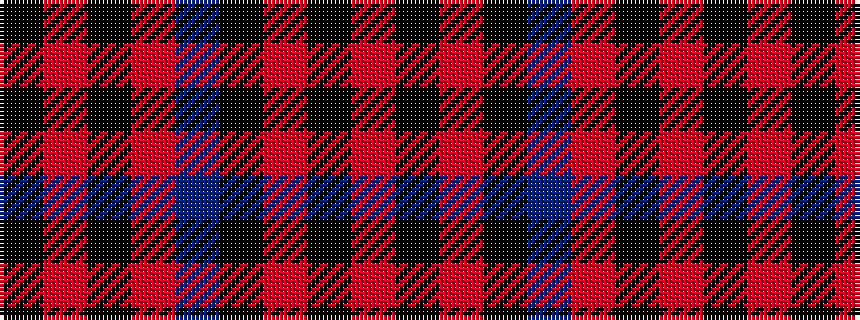

KRKRBKRKR

It is a 9 stripe tartan.

<figure class="pat-woven">

<figcaption>idealised sample</figcaption>
</figure>

## Colour Sequence



## Tartans with this colour sequence

| Tartans |
|---------------|
| [Gallmore (Fashion)](/setts/s9/o3k14r3k14t3r32k2r6k2~x2/)|
||
